中国大学生计算机设计大赛

**车旅迹忆**

目录

[**第一章 需求分析 [3](#需求分析)**]

[1.1 项目背景 [3](#_Toc21611)]

[1.2 竞品分析 [3](#_Toc79)]

[1.3 需求描述 [4](#_Toc1142)]

[**第二章 概要设计 [8](#概要设计)**]

[2.1 功能模块描述 [9](#功能模块描述)]

[2.2.接口设计 [10](#_Toc28141)]

[**第三章 详细设计 [10](#详细设计)**]

[3.1 界面设计 [10](#_Toc27634)]

[3.2 关键技术 [16](#_Toc27638)]

[**第四章 测试报告 [17](#测试报告)**]

[4.1接口测试 [17](#_Toc29956)]

[4.2技术指标 [22](#_Toc8911)]

[4.3压力测试 [23](#_Toc21034)]

[**第五章 安装及使用 [24](#安装及使用)**]

[5.1安装环境 [24](#_Toc21475)]

[5.2安装过程 [25](#_Toc21631)]

[5.3 典型使用流程 [25](#_Toc24687)]

[**第六章 项目总结 [27](#项目总结)**]

# 需求分析

道路交通系统是由人、车、路及其环境构成的动态复杂系统。其中，驾驶员是"人-车-路-环境"系统的核心要素，起决定性作用。

在小汽车普及的现在，因处于非正常驾驶状态的驾驶员未能得到及时的提醒而引发了众多的交通事故，据美国国家高速公路安全委员会统计表明，在道路交通致死事故中，驾驶员作为单一因素引发的交通事故占事故总量的65%左右，而与驾驶员因素有关的占近95%。我国由驾驶员相关因素引发的道路交通事故在事故总量中也占到90%左右。当驾驶员陷入非正常状态驾驶时，往往本人对此并无意识，因此适当的提醒以使得驾驶员迅速脱离非正常驾驶状态，有效地降低的降低危险驾驶的可能性，以减少交通事故的发生。然而目前市场上的驾驶软件往往只提供驾驶轨迹记录功能，缺少对于驾驶员状态检测、分析和相应的语音提醒功能。

因此我们在驾驶员状态检测、分析和语音提示方面做出了相应的研究，通过对驾驶员人脸面部特征检测，生理数据采集，构建驾驶员状态分析模型，来实时采集分析驾驶员的驾驶状态，并发送到用户手机，同时我们构建了相应的应用软件，对用户提供相应的应用服务，包括智能巡航，智能导航、语音提示等。

项目用例图展示了用户的相关用例，如图1-1所示。

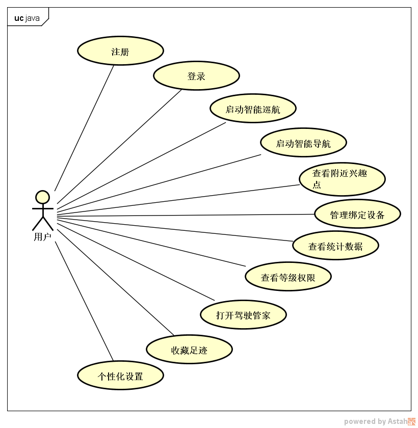
图1-1 用例图

项目部署图展示了项目的整体架构，项目采用前后端分离开发方式，包括用户软件、分发服务器、应用服务器、数据库服务器，四大部分，其中用户软件采用Android开发，分发服务器采用两台nginx服务器用作反向代理和负载均衡，应用服务器使用多台tomcat服务器作为后端请求处理，后端采用主流的SSM框架。数据库服务器中采用redis数据库作为数据缓存，以提高数据访问速度，同时采用多台MySQL数据库，实现用户数据的存储和备份，确保数据的完整性和可用性，如图1-2所示。

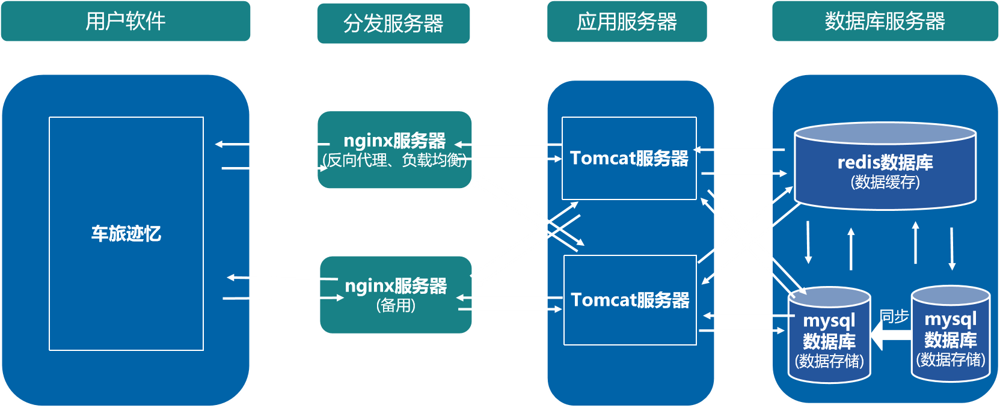

图1-2 部署图

1.  业务需求

    据统计每年发生的交通致死事故中，驾驶员异常状态驾驶作为主要诱因的占90%左右，大量的数据也证明，及时提醒驾驶员脱离异常驾驶状态，对于降低交通事故发生率起着至关重要的作用。因此驾驶员急需一款能够在导航的同时，也能够对驾驶员疲劳或者分心进行检测和语音播报提示的产品，来保障车内人员的安全。

2.  用户需求

    在驾驶过程中确保用户采用最少的操作以实现最佳的效果，驾驶状态检测预警系统应保证在不影响驾驶员驾驶的情况下，对用户做出最大程度的提示，同时还需要保证界面精美易操作，软件功能完备。

3.  功能需求

表1-3功能需求分析表

| 功能点               | 描述                                                                 |
| -------------------- | -------------------------------------------------------------------- |
| 登录功能             | 用户通过账号和密码登录本软件或者使用第三方账户登录                   |
| 注册功能             | 用户通过手机号或者邮箱注册账号                                       |
| 语音播报功能         | 根据用户定位地点实时播报前方路况                                     |
| 语音预警功能         | 根据疲劳检测情况对驾驶员进行语音播报预警                             |
| 兴趣点搜索功能       | 根据用户当前定位显示一定范围内的兴趣点                               |
| 兴趣点导航功能       | 用户点击兴趣点标记后能够进行路线导航                                 |
| 兴趣点收藏功能       | 用户点击兴趣点标记收藏后能够在收藏界面查看已收藏的兴趣点，便于用户操作 |
| 设备搜索功能         | 根据蓝牙搜索附近的蓝牙设备显示在屏幕上                               |
| 设备连接功能         | 点击屏幕上显示的蓝牙设备能够和蓝牙设备连接                           |
| 分类统计功能         | 提供总览展示或者年度分类展示历史轨迹数据                             |
| 轨迹回放功能         | 对用户的历史轨迹进行动画回放                                         |
| 图表分析功能         | 对于每次的驾驶生理数据等进行图表展示                                 |
| 详细展示功能         | 对于每次的驾驶数据和生理数据等进行数字化的展示                       |
| 等级权限功能         | 采用签到和任务机制，对于不同等级的用户提供不同权限和福利（包括更多样的个性化设置、卡券等） |
| 收藏功能             | 对于已收藏过的兴趣点在界面上进行列表展示                             |
| 足迹功能             | 系统能够记录用户驾驶去往的足迹                                       |
| 签到功能             | 用户能够进行每日签到提升自己的等级                                   |
| 卡券功能             | 用户在提升等级后能够获得一些卡券福利                                 |
| 资料功能             | 对于用户数据进行展示并且对部分用户数据能够进行修改                   |
| 最近驾驶回顾功能     | 用户能够查看最近的驾驶记录                                           |
| 驾驶管家功能         | 对于天气、路况、驾驶员状态和驾驶行为做出相应的建议和提示             |
| 帮助功能             | 对于一些常见的问题和解决方法能够在帮助界面进行列表展示               |
| 邀请功能             | 用户能够邀请新用户使用本产品并获取一些福利                           |
| 问题与建议功能       | 对于使用软件中出现的问题，用户能够上传文字和图片提交建议             |
| 更新功能             | 对于软件出现的新版本会有小圆点提示并点击后进行更新                   |
| 客服功能             | 对于使用中出现的问题用户能够对客服进行反馈，客服会在尽量短的时间内进行解答 |
| 设置功能             | 对导航、语音、消息、隐私等提供多种个性化的设置                       |

1.  非功能性需求

    （1）外观需求

    对于软件的外观，需要软件界面精美，软件重要功能需要显眼，同时符合人体工学设计，便于用户在不同情况下的操作使用。

    （2）易用性

    对于软件的易用性，需要用户用尽量少的操作来能够达到最好的效果，以便用户在驾车的过程中不因操作软件而导致驾驶分心，软件易操作，在初次安装软件时需要对用户进行有效地使用引导，避免因软件操作失误而导致的使用体验降低。

    （3）安全性

    对于软件的安全性，未经授权的用户将无法使用本软件，在用户除了登录注册之外的任何操作之前，都需要验证用户的合法身份，对于用户的所有输入都要进行测试，防止注入的风险，对于输入进数据库中的重要数据都需要，以MD5的方式进行加密处理。

    （4）完整性

    对于软件的完整性，系统将定期对数据库进行备份，以方便在遇到重大问题时能够进行恢复处理，同时采用多台Nginx服务器对用户请求进行转发，实现负载均衡，避免因单台服务器异常而导致整体系统的毁坏，开发过程中对于前后端的代码采用git版本管理，以便于在出现问题时能够及时进行恢复，此外对于系统的缓存垃圾进行定期处理，定期处理数据库中没有用的数据，用户能够对软件进行在线升级。

# 概要设计

##  本软件设计将功能分为十大模块，包括登录注册、智能巡航等，详情如下图：

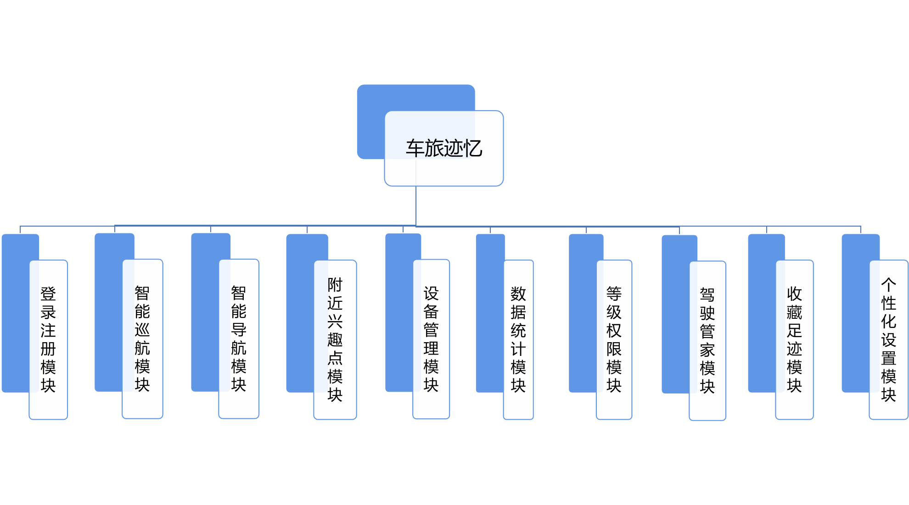

图2-1 功能模块图

## 2.1 功能模块描述

表2-1 功能模块描述表格

| 功能模块         | 描述                                                                 |
| ---------------- | -------------------------------------------------------------------- |
| 登录注册模块     | 用户使用邮箱、手机号或第三方账户登录注册平台，使用第三方账户登录要求用户绑定手机号。 |
| 智能巡航模块     | 默认采用此模式，用户点击驾驶图标将进入智能巡航功能，智能巡航提供实时轨迹绘制、语音播报路况、语音提示驾驶异常 |
| 智能导航模块     | 首页切换至此模式，用户点击驾驶图标将进入智能导航功能，智能导航提供导航路线设置、路线筛选、语音播报路况、语音提示驾驶异常 |
| 附近兴趣点模块   | 在地图上标明对应类别的兴趣点，提供兴趣点类别筛选、兴趣点搜索、兴趣点导航、兴趣点收藏 |
| 设备管理模块     | 蓝牙连接相关设备，包括耳机、穿戴式耳机、音频设备、车载设备、可穿戴设备以及指定设备 |
| 数据统计模块     | 提供总览展示或按年度分类展示，同时提供单次驾驶数据概览，对于每次驾驶数据，提供轨迹回放、图表分析、详细展示等多种展示方式 |
| 等级权限模块     | 采用签到和任务机制，对于不同等级的用户提供不同权限和福利（包括更多样的个性化设置、卡券等） |
| 驾驶管家模块     | 对于天气、路况、驾驶员状态、驾驶行为做出相应的建议和提示             |
| 收藏足迹模块     | 收藏喜爱的地点方便下次导航，系统记录用户驾驶去往的足迹               |
| 个性化设置模块   | 对导航，语音，消息、隐私等提供多种个性化设置                           |

**2.2.接口设计**

**2.2.1外部接口**

（1）用户界面

在用户界面部分，根据需求分析的结果，为提供给用户友好的交互界面。本软件采用圆角卡片和通栏卡片相结合的UI设计风格，采用合理的色彩搭配，并配合使用适当的插画和图标，符合大众的审美，给予用户舒适的操作体验。

（2）软件接口

客户端和服务器端采用网络连接，使用Retrofit来进行网络请求以获取相应数据，同时使用本地数据库SQLite作为本地存储，存储相关资源数据。

**2.2.2内部接口**

内部接口方面，各模块之间采用函数调用、参数传递、返回值的方式进行信息传递。合理地安排了接口的继承与组合关系，遵守面向对象的基本原则，合理采用了合适的设计模式，降低了接口间的耦合度，提高了软件的灵活性和复用性。

# 详细设计

**3.1 界面设计**

整体设计理念以用户为中心，紧紧抓住本软件服务驾驶员的核心，预见到若驾驶员在驾驶过程中操作手机将极大增加用户分心驾驶的分心，因此为用户的安全性以及便利性考量，将驾驶过程中软件的操作减少到最低，同时其他界面也为用户使用精心考虑，将各个界面核心功能放在页面中心偏下位置，符合用户操作手机的习惯，便于不同情况的迅速操作。

整体UI风格也是精心设计，界面生动明快。色彩鲜明的图标会更容易抓住用户的视觉焦点，充分为用户的便利性考虑。\
软件采用卡片式布局，对不同信息内容进行有序的整理，每一个卡片矩形承载的信息分为一个版块，可以使界面保持一致性，并且使整个界面看起来更加的有序，这种整齐的排版将信息和图像放到了一个板块里，避免因为信息多而造成视觉混乱的情况，像这种模块化展示减少用户思考的时间，能快速找到所需信息。

界面设计采用Figma统一绘制，部分页面设计如下图所示：

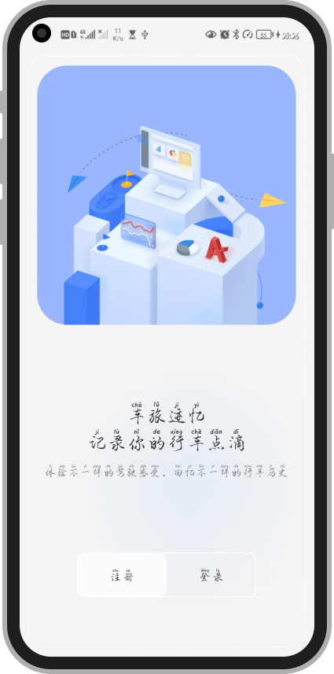
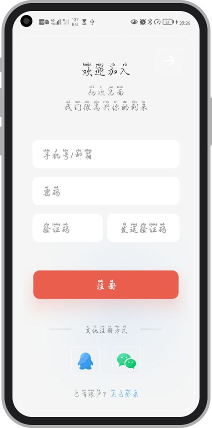

> **图3-1启动界面 图3-2 注册界面**

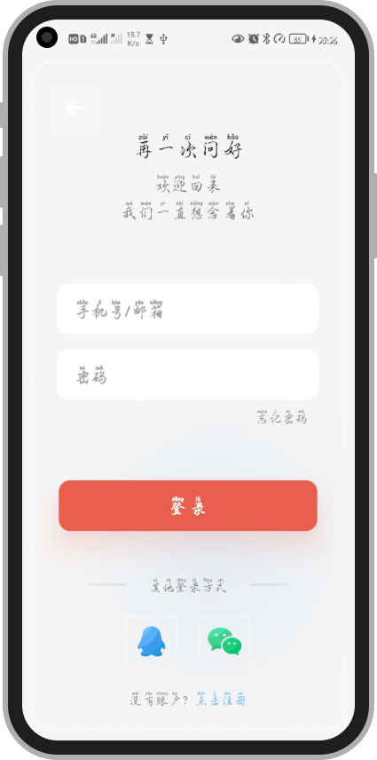
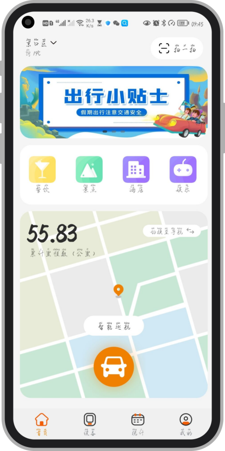

**图3-3 登录界面 图3-4 首页界面**

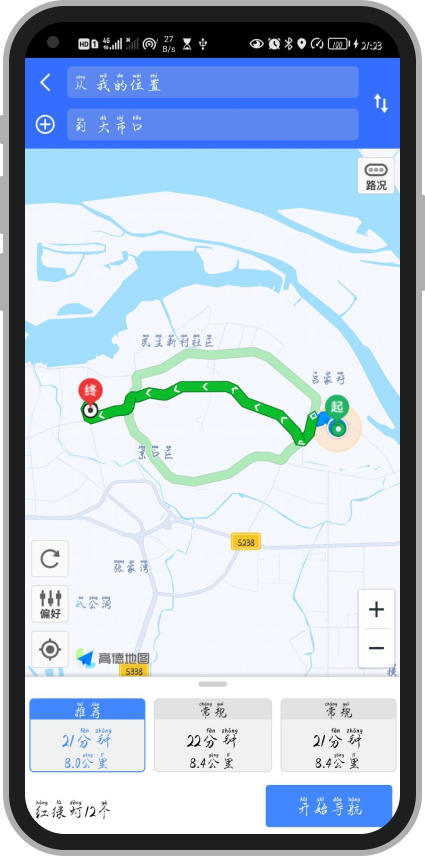

**3-5 导航界面 图3-6 地点搜索界面**

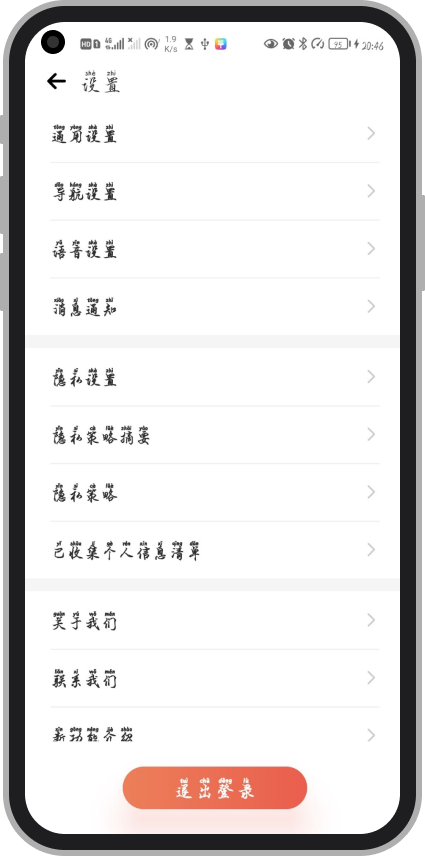
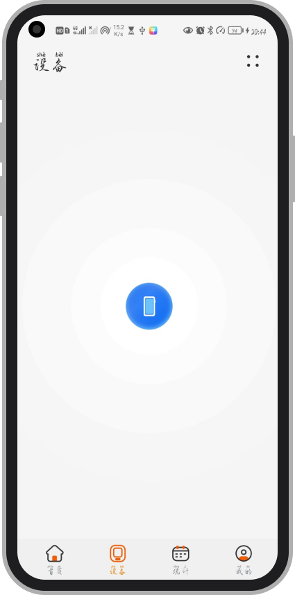

**图3-7 个人设置界面 图3-8 绑定设备界面**

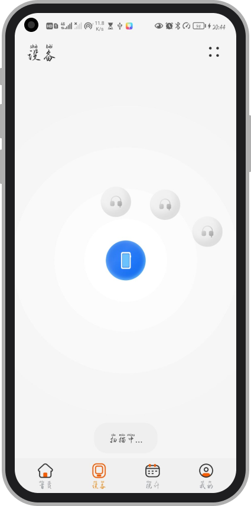
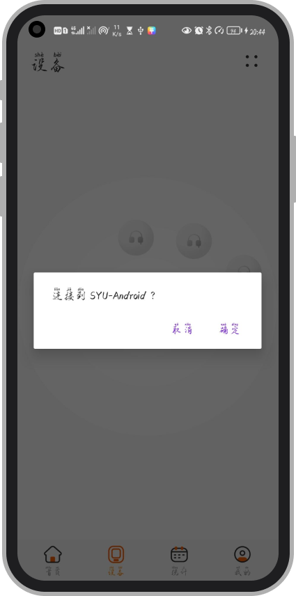

**图3-9 扫描设备等待界面 图3-10 连接设备请求界面**

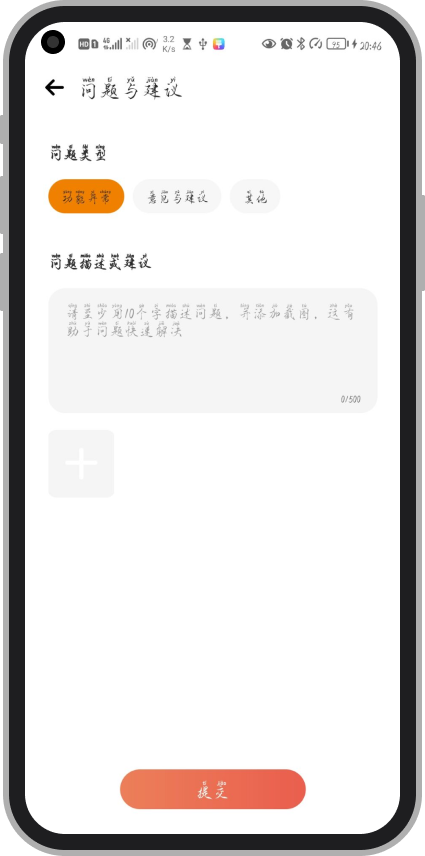
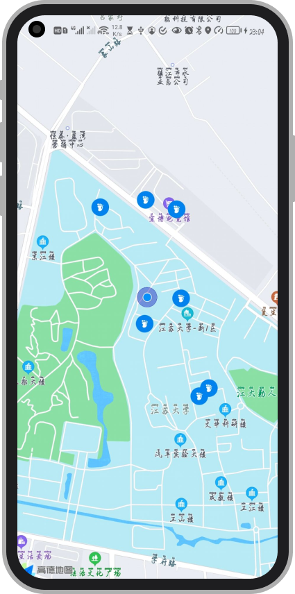

**图3-11 反馈问题建议界面 图3-12 地图界面**

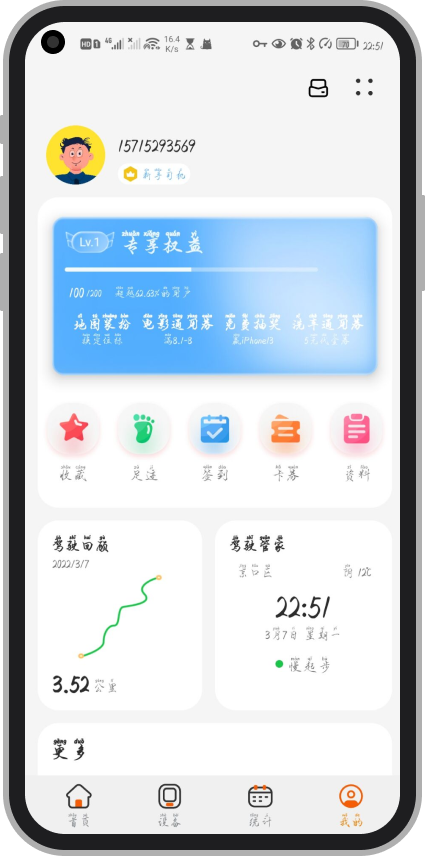
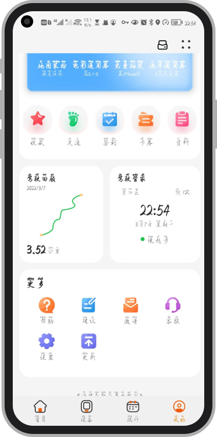

**图3-13我的个人信息界面 图3-14 个人信息界面**

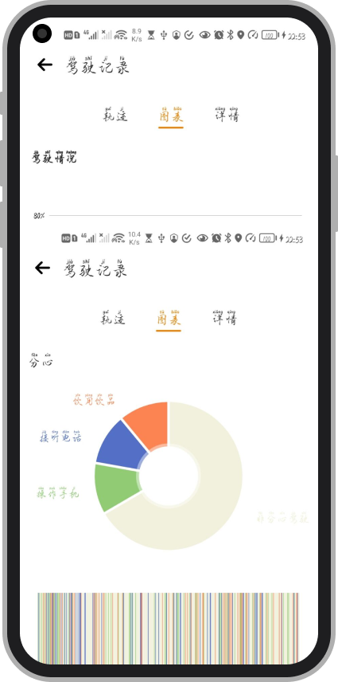
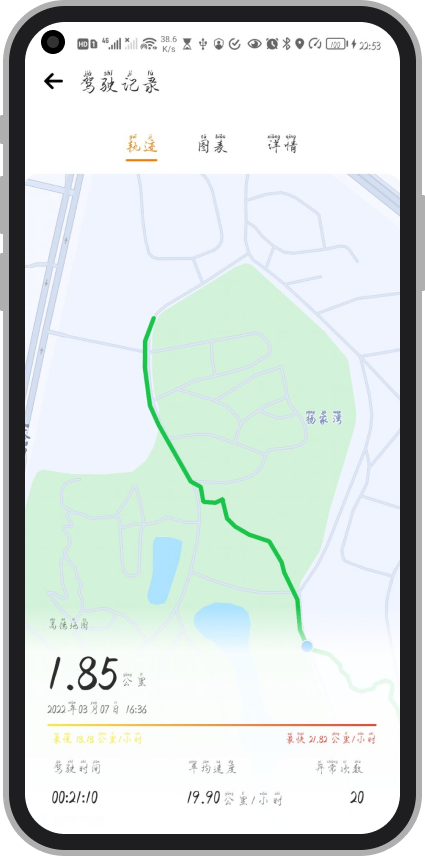

**图3-15 驾驶情况分析界面2 图3-16驾驶记录轨迹界面** 
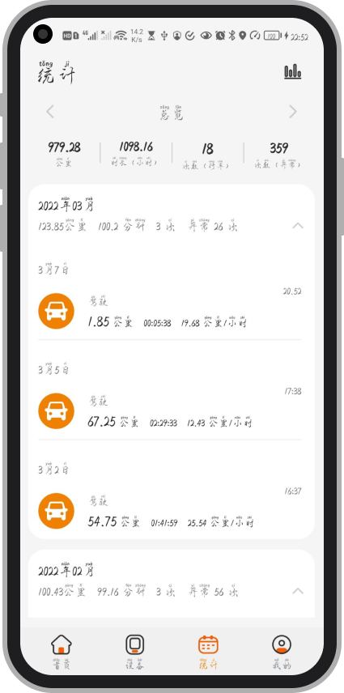
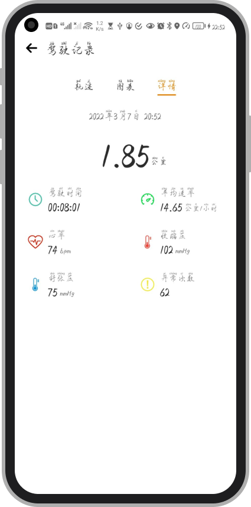

**图3-17驾驶记录统计界面 图3-18驾驶记录详情界面**

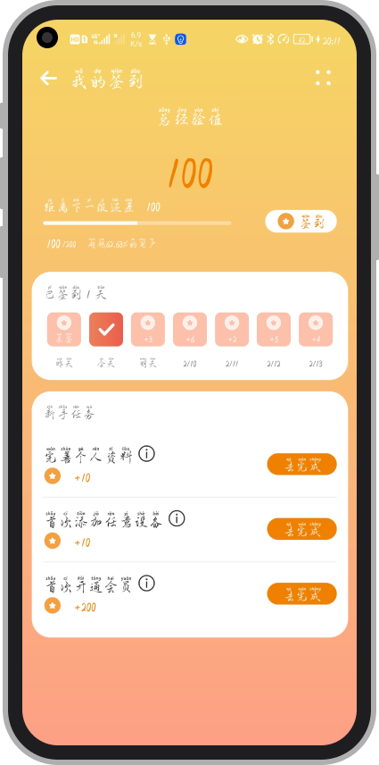
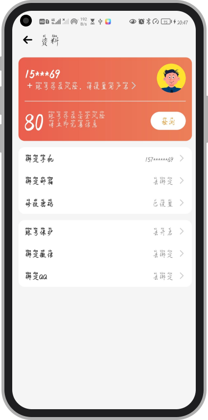

**图3-19 签到界面 图3-20 个人资料信息界面图**

**3.2 关键技术**

**3.2.1 轨迹绘制技术**

轨迹绘制技术：首先通过高德地图定位功能获取当前的位置，获取当前的经纬度，若当前的经纬度和上一次定位的经纬度不一致则进行筛选点，若当前的精确度大于一定阈值则不进行画线，否则将当前经纬度的点和上一次定位经纬度的点连接作为轨迹并绘制在地图上。

**3.2.2 点筛选存储技术**

点筛选存储技术：将存储的所有轨迹点进行抽稀，其中五个为一组，将首尾两点连接，计算中间三个点与连接线之间的距离，若距离小于一定阈值，则认为该点在连线上，则删除该点，这样可以大大减少需要向服务器传输的数据量大小，减小服务器的压力。

**3.2.3 周边POI检索技术**

周边POI检索技术：在地图表达中，一个POI可代表一栋大厦、一家商铺、一处景点等等。通过POI搜索，完成找餐馆、找景点等等的功能。POI
数据包含的名称信息、位置信息等，能满足用户的基本需求------使用电子地图"查找目的地"，进而唤起导航服务。POI数据可以支持电子地图提供"搜索附近"、"点评"等功能，这些操作可以提高用户的使用和活跃时长。POI数据还是线上线下连接互动的一个纽带，是基于位置服务（Location
Based
Service）产业的一个重要组件。通过高德地图的定位功能获取当前的经纬度，然后通过高德提供的兴趣点获取功能获取周围一定范围内的兴趣点，将兴趣点进行标记，当点击标记的时候弹出模态框，可以进行详细信息的查看和位置的导航，若当前的定位改变，则将保存的兴趣点集合改变，将改变定位后获取的兴趣点集合和上一次定位获取的兴趣点集合进行比较，共同部分不进行操作，将改变定位后获取的兴趣点集合拥有而上一次定位获取的兴趣点集合没有的兴趣点集合进行绘制，将改变定位后获取的兴趣点集合没有而上一次定位获取的兴趣点集合拥有的兴趣点集合进行移除，这样可以防止重绘所有兴趣点造成的用户体验度降低的问题。

**3.2.4 POI关键词检索技术**

POI关键词检索技术：通过高德地图提供的输入信息提示功能，获取用户输入的关键字后进行检索，将检索数据内的兴趣点信息进行列表展示，并进行距离从小到大排列，将一定距离内的兴趣点可以进行导航，若检索到的数据为更完整的关键词，则在用户点击下方搜索更多后进行更完整的搜索。将搜索历史和点击的兴趣点存储到本地数据库，方便进行历史记录的查找。

# 测试报告

## 4.1接口测试

4.1.2测试环境

表4-2 测试环境表

| 环境类型   | 环境情况                                                                 |
|------------|--------------------------------------------------------------------------|
| 操作系统   | Windows10、Android 11、Android 10、HarmonyOS 2.0.0                        |
| 网络环境   | WLAN局域网                                                               |
| 设备环境   | PC电脑，运行内存：8G；HUAWEI nava 4 搭载 HarmonyOS 2.0.0；HUAWEI nava 7 搭载 HarmonyOS 2.0.0；模拟器 搭载 Android 11；模拟器 搭载 Android 10 |

4.1.3测试工具

表4-3 测试工具表
| 工具类型       | 工具名称 |
|----------------|----------|
| 接口测试工具   | Postman  |
| 版本管理工具   | Git      |
| 接口管理工具   | Apifox   |

4.1.4登录接口

（1）测试过程

测试后端login接口，在postman中新建一个用于/login接口的Request，具体如图4-1所示,Body参数采用post方法的默认传输格式，采用本地测试路径http://localhost:8081/login，响应类型采用自定义类ResponseMapJSON，登录接口测试具体用例如表4-4所示。

表4-4 登录接口测试用例

1.  测试结果

响应结果异常，并没有对不存在的账户存在特判，测试结果如图4-1所示。

图4-1 登录接口测试结果

（3）修正过程

当查找不到对应的用户时，对于实体类的操作会造成运行时异常，所以对于此情况设置特判显示"用户不存在"，进行断言拦截。

（4）修正结果

登录接口修正结果如图4-2所示。

图4-2登录接口修正结果

4.1.5注册接口

1.  测试过程

测试后端verifycode接口，在postman中新建一个用于/verifycode接口的Request，具体如图4-4所示，Body参数采用post方法的默认传输格式，采用本地测试路径http://localhost:8081/verifycode，响应类型采用自定义类ResponseMapJSON，注册接口测试用例如表4-5所示。

表4-5 获取验证码接口测试用例

（2）测试结果

测试结果显示获取不到对应的验证码，如图4-3所示。

图4-3 注册接口测试结果

（3）修正过程

项目使用阿里云服务器，测试邮件服务时，默认使用了25端口，25端口为简单邮件传输协议（SMTP）服务所开发，是用于发送邮件的。但是目前很多服务器运营商都已经屏蔽了25端口，因为25端口会导致服务器不安全，黑客可以利用25端口寻找SMTP服务器，用来转发垃圾邮件和传播恶意软件。

所以改用465端口进行发送邮件。465端口是为SMTPS（SMTP-over-SSL）协议服务开放的，这是SMTP协议基于SSL安全协议之上的一种变种协议，它继承了SSL安全协议的非对称加密的高度安全可靠性，可防止邮件泄露。

（4）修正结果

获取验证码接口修正后即可正常获取验证码，如图4-4和图4-5所示。

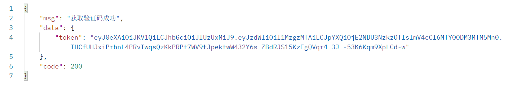

图4-4 注册接口修正结果

图4-5 邮箱获取验证码

4.1.7建议接口

（1）测试过程

测试后端advice接口，在apifox中新建一个用于/advice接口的Request,具体如图4-8所示，Body参数采用post方法的默认传输格式，新增自定义Header类型token,采用服务器测试路径http://47.96.138.120:6583/advice，响应类型采用自定义类ResponseMapJSON，建议接口测试用例如表4-6所示。

表4-6 建议接口测试用例

1.  测试结果

发生文件查询异常错误，测试结果如图4-6所示

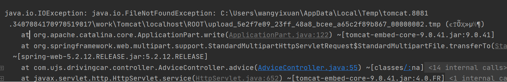{width="5.764583333333333in"
height="0.9368055555555556in"}

图4-6 建议接口测试结果

（3）修正过程

项目原本采用tranferTo函数进行图片上传，但是会在Tomcat临时文件处出错。

采用cpoyInputStreamToFile函数方法进行图片上传。

（4）修正结果

建议接口修正后即可正常提交建议结果如图4-7所示。

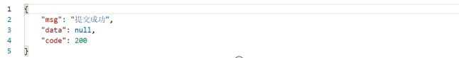

图4-7 建议接口修正结果

## 4.2技术指标

本项目环境的最低配置如表4-7所示，推荐配置如表4-8所示，运行速度、安全性、扩展性、部署方便性和可用性等多维度的技术指标数据如表4-9所示。

表4-7 最低配置

| 技术指标       | 说明                |
|----------------|---------------------|
| Android版本    | 8.0                 |
| 运行内存       | 4.0GB               |
| 存储           | 32GB                |
| CPU            | 双核2GHz及以上      |
| 屏幕分辨率     | 1920x1080           |

表4-8 推荐配置

| 技术指标       | 说明                |
|----------------|---------------------|
| Android版本    | 11.0                 |
| 运行内存       | 6.0GB               |
| 存储           | 64GB                |
| CPU            | 双核2GHz及以上      |
| 屏幕分辨率     | 2244x1080           |

表4-9 多维度技术指标

| 技术指标       | 说明                |
|----------------|---------------------|
| 负载状态       | 22% 运行流畅        |
| CPU使用率      | 24.5%               |
| 内存使用率     | 83.8%               |
| 安全性         | 良好                |
| 扩展性         | 良好                |
| 部署方便性     | 优秀                |
| 可用性         | 优秀                |

## 4.3压力测试

（1）测试工具说明

采用apache的开源测试工具jmeter，采用jmeter代理服务器录制脚本生成http请求脚本,并通过http协议get方式发送访问请求,收集服务器响应速度,服务器资源耗用情况。

 

（2）测试场景说明

| 序号 | 功能名称           | 并发数          | 持续时间 | 场景说明                                                     |
|------|--------------------|-----------------|----------|--------------------------------------------------------------|
| 1    | 用户登录           | 10/30/60/100    | 10       | 模拟10/30/60/100人同时登录系统，系统响应时间                 |
| 2    | 用户注册           | 10/30/60/100    | 10       | 模拟10/30/60/100人同时注册账户，系统响应时间                 |
| 3    | 智能巡航           | 10/30/60/100    | 10       | 模拟10/30/60/100用户同时使用智能巡航功能，检查软件是否可以承受压力 |
| 4    | 统计页面数据查看   | 10/30/60/100    | 10       | 模拟10/30/60/100用户同时获取统计界面数据，检查软件是否可以承受压力 |

（3）并发响应情况

| 事务名称           | 并发用户数 | 事务最小响应时间 | 事务平均响应时间 | 事务最大响应时间 | 90%用户平均响应时间 | 事件成功率  |
|--------------------|------------|------------------|------------------|------------------|--------------------|-------------|
| 用户登录           | 10         | 0.981            | 2.104            | 6.142            | 2.12               | 100.00%     |
|                    | 30         | 1.552            | 4.015            | 8.771            | 3.14               | 100.00%     |
|                    | 60         | 2.101            | 6.801            | 11.519           | 5.33               | 100.00%     |
|                    | 100        | 5.142            | 8.112            | 14.112           | 9.60               | 98.92%      |
| 用户注册           | 10         | 1.081            | 2.104            | 8.672            | 3.35               | 100.00%     |
|                    | 30         | 1.801            | 4.015            | 10.467           | 4.56               | 99.82%      |
|                    | 60         | 2.543            | 6.801            | 12.293           | 8.25               | 99.52%      |
|                    | 100        | 6.001            | 8.112            | 15.102           | 12.91              | 99.19%      |
| 智能巡航           | 10         | 0.281            | 0.298            | 0.312            | 0.25               | 100.00%     |
|                    | 30         | 0.352            | 0.369            | 0.481            | 0.36               | 100.00%     |
|                    | 60         | 0.501            | 0.553            | 0.603            | 0.55               | 100.00%     |
|                    | 100        | 0.695            | 0.751            | 0.821            | 0.74               | 99.71%      |
| 统计页面数据查看   | 10         | 0.238            | 0.245            | 0.394            | 0.24               | 100.00%     |
|                    | 30         | 0.312            | 0.324            | 0.389            | 0.32               | 100.00%     |
|                    | 60         | 0.489            | 0.512            | 0.524            | 0.50               | 100.00%     |
|                    | 100        | 0.512            | 0.556            | 0.677            | 0.53               | 99.92%      |

（4）压力测试结论

目前系统最佳使用用户数量为200人，如超过该用户人数需要提供服务器配置，如果想要增加承压能力，建议修改网络环境配置，数据库的容量。

存在的问题:同时用户登录、用户注册、统计页面数据查看等在超过100用户同时使用时，速度降低，用户等待时间增加，影响系统效率，后续系统会对这些功能模块进行优化，如数据懒加载等。

# 安装及使用

## 5.1安装环境

安卓操作系统版本大于等于8.0，具体安装环境如表5-1所示。

表5-1 安装环境

| 所需权限                                   | 说明  |
|--------------------------------------------|-------|
| 读取存储卡的内容                           | true  |
| 修改或删除SD卡的内容                       | true  |
| 读取通话状态和移动网络信息                 | false |
| 查看WLAN状态                               | true  |
| 访问大致位置信息（使用网络进行定位）       | true  |
| 访问大致位置信息（使用GPS和网络进行定位）  | true  |
| 拍摄照片和录制视频                         | false |
| 查看网络连接                               | true  |
| 访问蓝牙设置                               | true  |
| 控制振动                                   | true  |
| 完全的网络访问权限                         | true  |
| 与蓝牙设备配对                             | true  |
| 麦克风-录制音频                            | false |

## 5.2安装过程

用户下载apk安装包后，点击下载，系统会解压apk拷贝文件并创建对应的应用数据目录，系统完成安装后点击打开或者完成，进入app后赋予一定的权限即可。

## 5.3 典型使用流程

5.3.1 注册

用户进行注册流程，输入注册信息，点击发送验证码，系统发送用户6位随机数，用户输入验证码后验证验证注册信息，如果不符合要求重新输入注册信息，若符合注册要求，将跳转至注册页面，活动图如图5-1所示。

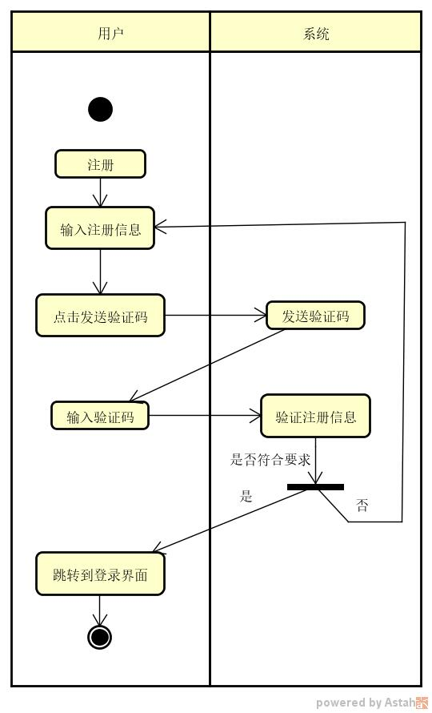

图5-1 注册活动图

5.3.2登录

用户进行登录流程，输入登录信息，系统验证登录信息，系统判断是否符合登录要求，若登录失败重新登录，若登陆成功则跳转到主界面主要流程等，登录活动图如图5-2所示。

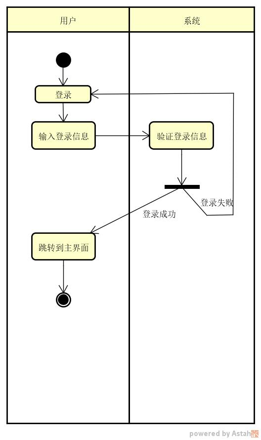

图5-2 登录活动图

5.3.3 巡航

用户进行巡航流程，点击开始进入巡航，系统实时定位并绘制轨迹和兴趣标记点，显示时间路程等信息，用户点击暂停，系统暂停定位和轨迹绘制。用户点击结束跳转至轨迹回放界面，巡航活动图如图5-3所示。

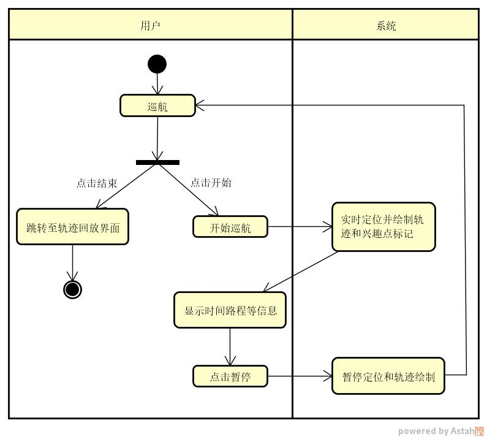
图5-3巡航活动图

# 项目总结

## 6.1感悟

此次移动应用开发，项目团队成员采用前后端分离模式，分工明确。前后端分离模式使得前端人员专注于进行页面渲染的代码编写，仅需要提供接口用来接收传输数据即可，并不需要考虑数据的处理问题；后端人员只进行数据的处理，仅需要提供一套逻辑对外传输数据即可，也不需要关注前端代码，双方都只负责各自的代码，开发可以同时进行，使得开发效率大大提高。同时若后端接口没有及时编写完成时，团队也采用了mock虚拟数据服务器进行数据的模拟。使用了ApiFox进行了接口文档的管理，前后端开发人员都有权限查看和修改接口文档，并在后端接口开发完成时，能够及时在ApiFox中对接口进行运行测试。前后端都采用了git工具进行版本的管理，每一个提交的版本都有提交信息，方便开发人员对版本的控制。

6.1.1前端开发感悟

此次开发过程中运用到了大量的第三方库包括Retrofit（网络请求）、MPAndroidChart（图表）、TkrefreshLayout（下拉回弹）、BannerViewpager（轮播图）、高德地图的SDK等，锻炼了我们阅读文档使用接口的能力。

为了使项目的开发更加的便捷，我们封装了多个工具类，将开发过程进一步简化，在封装的过程中我们也考虑到了更加复杂情况下的使用以及日后项目的复用性，采用诸如建造者模式、单例模式的设计模式进行封装，符合7个重要的面向对象原则，增强了我们工程化项目的开发能力；

为了使组件更加符合项目的要求，我们自行设计了多个组件，其中包括LoadingView（加载动画组件）、SpreadView（水波扩散组件）、NoScrollViewPager（无滑动ViewPager）、HintDialog（提示对话框）、ExpandLayout（伸缩布局）以及自定义图表等，提高了我们对于Android组件的理解和自主设计开发能力。

6.1.2后端开发感悟

后端采用SpringBoot框架进行开发，在后端开发过程中体会到了Spring Boot的强大优势,对于Spring Boot的理解更加深入。\
在开发中利用Spring Boot更为方便快捷地创建了Spring框架，并且只需要一个依赖即可启动Web容器。并且在开发测试时感受到Spring Boot的强大之处：它内置了嵌入式Tomcat,容器，生产部署时，只需要一个Java命令就可以启动了，极大地提高了后端的开发效率，并且开发和生产用的是同一个嵌入式Tomcat，避免了不同环境因容器差异而出现问题。

6.2困难与提升

在此移动应用项目开发过程中，我们遇到了各种各样的困难，但是团队内成员经常在一起讨论，互帮互助，攻克了一个个难点。

初次接触Android开发，对于相应组件的应用还有一定的不足，在这次开发中我们遇到了诸如第三方库使用调错(尤其是高德地图开发和图表开发)、前后端接口统一与联调、UI设计与实现这些困难，不过最后我们还是成功将其克服，最终将我们学习的知识转化为实际的软件，使我们对Android开发有了更深入的理解和掌握。

6.3后续升级

由于项目采用敏捷开发模式，因此我们对于此软件还有更多可以改进的地方，在后期开发中我们将进行如下优化：

（1）手机号一键登录功能已简化用户登录注册的操作。

（2）提供token续签功能，对于近期有使用的用户进行token续签已减少登录的繁琐。

（3）完善用户等级系统，推出更多任务，增加用户粘黏性。

（4）接入智能客服系统，降低人工客服使用频率，减少项目运营成本

（5）完善帮助功能，总结用户使用反馈和提交建议。

（6）接入热修复功能，应用上线后出现bug需要及时修复时，不用再发布新的安装包，只需要发布补丁包，在客户无感知下修复掉bug

（7）优化软件UI界面，增强用户的视觉体验、操作体验、信息体验、需求体验和交互体验。

（8）优化软件性能，采用Jetpack对软件进行重构。

6.4商业推广

6.4.1市场推广

为了能够在短时间内有效快速的将本产品推向市场，本项目拟采用"三步走"战略对项目产品进行商业推广，具体的策略如下：第一步：首先对城市全行业提供基础版软件，基础版本的软件仅包含基本情绪检测和导航等功能，基础版本免费使用，通过免费版本软件迅速抢占市场份额，提升用户量。第二步：对于大型的公共交通安全管理公司、出租车公司等，提供收费版本的标准版本软件，标准版软件能够提供所有的系统功能，包括复杂的驾驶情绪驾驶数据分析、智能化驾驶建议等等，并且提供免费上门安装和在线指导等售前售后服务。第三步：针对不同地区有特殊需求的相关单位或者个人，本产品提供定制化的服务开发，通过与客户签订合同进行软件系统开发。

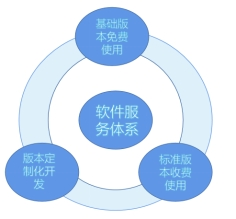

图6-1三步走战略图

6.4.2应用商城推广

应用商城是用户下载应用的主要通道，围绕应用商城推广软件是非常关键的第一步。

1、软件提交

将软件提交至华为、小米、oppo、vivo、魅族等品牌的Android应用市场，全面覆盖建立符合用户习惯的下载渠道，方便用户通过各种渠道进行下载使用。

2、软件推荐

应用市场作为第三方，具备较高的公信力，因此，软件作为应用市场的推荐软件，将会获得更多的关注和信任。

6.4.3社会化媒体推广

社会化媒体推广SNS是用户用有极大参与空间的新媒体类型，泛指方便用户撰写、分享、评价、讨论、沟通的互联网工具和平台，比如国内的新浪微博、腾讯微信和国外的Facebook、Twitter、Instagram等。

1、论坛类媒体

论坛类媒体如微博，贴吧等是用户分享信息的集散地，每天都有许多信息通过论坛进行发布，吸引用户的眼球，因此，撰写关于软件的评测软文、特色功能、所获荣誉等都是非常好的题材，但是单篇论坛帖子如果不维护的话，很快就会沉底，因此，需要发布帖子博文并安排专人进行维护置顶。

2、视频网站

将软件相关视频上传至国内主流的视频网站，将重心放置在中视频网站如B站、西瓜视频以及短视频如抖音等平台。帮助客户更直观地了解软件，可以覆盖相关报道、品牌介绍、使用操作等。

6.4.4搜索引擎推广

搜索引擎是互联网用户获取信息的主要渠道，一般用户在完成搜索后，习惯按排名顺序进行浏览，因此，保证软件相关关键词能够排名靠前是非常关键的。

1、搜索引擎优化（SEO）

搜索引擎优化（SEO），是针对官网进行利于搜索引擎排名的优化，优化内容包含：关键词优化、内容优化、链接优化。

关键词优化，主要是对官网的关键词分布，关键词密度进行优化建议。我们根据选取的官网关键词，参考百度为主，查看关键词在百度排名前10位网站的关键词密度，以他们的关键词密度范围为基准，优化自己网站的关键词密度。

内容优化，主要从以下几个方面着手：官网的技术层面，代码是否简洁，页面标题（Title）、关键词（Keyword），描述（Description）、网页的内容是否充实，图片标签是否优化。

链接优化，网站链接包括内部链接和外部链接。内部链接：内部链接是指本网站内部网页之间的链接（包含了导航栏和面包屑导航）。外部链接：外部链接是指本网站外部的链接，分为导入链接和导出链接两种。

6.4.5移动广告推广

通过移动广告平台精准投放广告覆盖上述用户群，已经成为移动互联网营销的新趋势。利用新媒体进行定向推荐产品，例如在内容创作平台找到汽车驾驶相关的内容创作者打广告。

综上所述，通过各种渠道对软件进行全方位推广，获得更多曝光率和下载量，让软件不再只是摆设和花瓶，后期再通过高效的软件运营，吸引用户保持黏性，从而让软件的发挥出最大商业价值。
